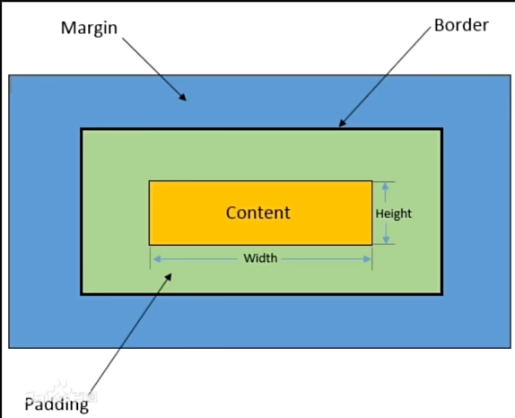
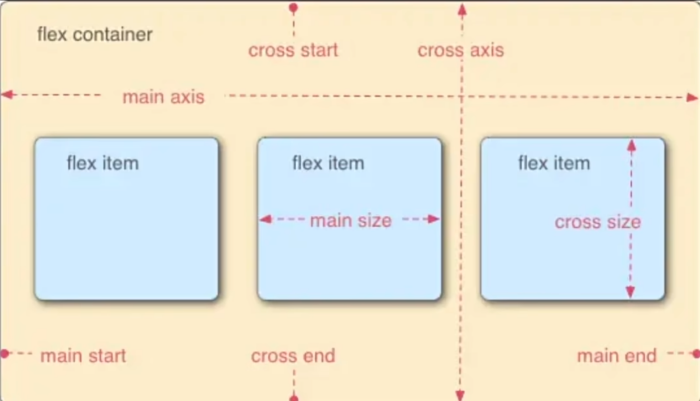

参考视频 [BV1BT4y1W7Aw](https://www.bilibili.com/video/BV1BT4y1W7Aw) 做的笔记。

# Vscode 插件

- HTML CSS Support
- Live Server
- Auto Rename Tag
- JavaScript Debugger

**vscode 快捷键：**如果提前想好了 div 中的 **class** 是什么的话，比如说是 nav，可以输入 `.nav` 然后输入 tab 就可以扩充成 class 是 nav 的 div 标签。如果提前想好了 div 中的 **id** 是什么的话，比如说 id 为 idnav，可以输入 `#nav` 然后 tab 扩充成 id 为 idnav 的 div 标签。

# HTML

## 基础 HTML 结构

```html
<!DOCTYPE html>
<html>
    <head></head>
    <body>
        
    </body>
</html>
```

- `<!DOCTYPE html>` 表示这是一个 html 文件
- `<html>` html 文件的根元素、起始点，文档的最外层容器
- `<head>` 文档的头部，包含了一些文件的原信息
- `<body>` 实际显示在浏览器中的内容

vscode 中可以输入 `!` 然后使用 `tab` 输入 html 基础模板，然后可以右键使用 live server 查看实时修改内容。

## 一些 html 文本标签

类似 markdown，也有六级标题，分别是 `<h1>` 到 `<h6>`。以下是 body 部分的代码。

```html
<body>
    <h1>一级标题标签</h1>
    <h2>二级标题标签</h2>
    <h3>三级标题标签</h3>
    <h4>四级标题标签</h4>
    <h5>五级标题标签</h5>
    <h6>六级标题标签</h6>
    <p>这是一个段落标签</p>
</body>
```

分别有如下字体格式：

- `<b>/<strong>` 加粗
- `<i>` 倾斜
- `<u>` 下划线
- `<s>` 删除线

无序列表 (unorder list) 与有序列表 (order list)，下面有若干列表项 (list item)。如下所示：

```html
<ul> <!-- 无序列表 -->
    <li>无序列表1</li> <!-- 列表项 -->
    <li>无序列表2</li>
    <li>无序列表3</li>
</ul>
<ol> <!-- 有序列表 -->
    <li>有序列表1</li> <!-- 列表项 -->
    <li>有序列表2</li>
    <li>有序列表3</li>
</ol>
```

一个 table 中会包含很多表格行 (table row, tr) 以及很多表格数据 (table data, td)，还有重要的表头 (table header, th)。要加边框在最开始加上 `border="1"`，双引号内可以调版式。详细代码如下：

```html
<table border="1">
    <tr>
        <th>header1</th>
        <th>header2</th>
        <th>header3</th>
    </tr>
    <tr>
        <td>row1 data1</td>
        <td>row1 data2</td>
        <td>row1 data3</td>
    </tr>
    <tr>
        <td>row2 data1</td>
        <td>row2 data2</td>
        <td>row2 data3</td>
    </tr>
    <tr>
        <td>row3 data1</td>
        <td>row3 data2</td>
        <td>row3 data3</td>
    </tr>
</table>
```

## HTML 基本属性

基本语法：

```html
<开始标签 属性名="属性值">
```

- 每个 HTML 元素可以有不同的属性
- 属性名不区分大小写，属性值区分大小写

### 适用于大多数 HTML 元素的属性

| 属性  | 描述                                                 |
| ----- | ---------------------------------------------------- |
| class | 为 HTML 元素定义一个或多个类名（类名从样式文件引入） |
| id    | 定义元素唯一的 id                                    |
| style | 规定元素的行内样式                                   |

### 一些 HTML 标签

- `<a href="https://www.baidu.com" target="_self">这是一个超链接</a>`  a 标签常用于超链接到其他的网页或位置
  - href：链接，如果为 `#` 号即设置一个无法跳转的链接。
  - target（似乎只有 `_self` 和 `_blank` 比较有用）：
    - `_self`：默认值。超链接在当前窗口中打开
    - `_blank`：新的标签页中打开
    - `_parent`：父窗口中打开，**看起来好像不知道有什么用**
    - `_top`：顶层窗口中打开，**看起来好像也没什么用**
- `<br>` 换行标签，`<a>` 标签没法换行，需要使用 `<br>` 来换行
- `<hr>` 水平分割线，输入会自动换行且给一个分割线
- `` 图片标签
  - src：图片地址（url 或地址）
  - alt：替代文本。如果图片无法加载，将显示 alt 中指定的文本
  - width：宽度（如果只设置宽度及高度其中一项，另一项也会等比例缩放）
  - height：高度（如果只设置宽度及高度其中一项，另一项也会等比例缩放）

```html
<body>
    <a href="https://www.baidu.com">这是一个超链接</a> <br>
    <a href="https://www.baidu.com" target="_blank">这是一个超链接</a> <hr>
    <a href="https://www.baidu.com" target="_parent">这是一个超链接</a>
    <a href="https://www.baidu.com" target="_top">这是一个超链接</a> <br>
    <br>
    <br>
    <br>
</body>
```

## HTML 区块 - 块元素与行内元素

块元素可以简单地理解为可以在 HTML 文件中独占一行的元素（如 `<p>, <table>, <h1>` 等）；而行内元素可以简单地理解为无法独占一行的元素（如上面提到的 `<a>` 标签等）。

### 块级元素

块级元素通常用于组织和布局页面的主要结构和内容，例如段落、标题、列表、表格等。它们用于创建页面的主要部分，将内容分隔成逻辑块。

- 块级元素通常会从新行开始，并占据整行的宽度，因此它们会在页面上呈现为一块独立的内容块。
- 可以包含其他块级元素和行内元素。
- 常见的块级元素包括 `<div>`、`<p>`、`<h1>` 到 `<h6>`、`<ul>`、`<ol>`、`<li>`、`<table>`、`<form>` 等。

### 行内元素

行内元素通常用于添加文本样式或为文本中的一部分应用样式。它们可以在文本中插入小的元素，例如超链接、强调文本等。

- 行内元素通常在同一行内呈现，不会独占一行。
- 它们只占据其内容所需的宽度，而不是整行的宽度。
- 行内元素不能包含块级元素，但可以包含其他行内元素。
- 常见的行内元素包括`<span>`、`<a>`、`<strong>`、`<em>`、``、`<br>`、`<input>`等。
- **注：有一些行内元素实质上是行内块元素**：如 ``，它可以指定宽度和高度，但是例如 `<span>` 这种则不可以。

### div 标签

块级标签。通常用于创建一个可以包含其他 HTML 元素的容器块。

### span 标签

行内元素。相当于没有特殊元素的 a 标签和 img 标签。主要作用是把一部分图片、文本包装起来使用样式、CSS 或者是 JS 行为。

## HTML 表单

HTML 表单常用 form 标签。

### form 标签

表单。

- `action`：假如有 submit 时，点击表示向何处发送数据。action 的属性值也是一个 URL。

### input 标签

单标签，有几十个属性，常用的就几个：

- `type`：input 元素类型
  - `text`：文本框输入
  - `password`：密码框
  - `radio`：单选按钮
  - `checkbox`：多选按钮
  - `submit`：提交
- `placeholder`：如果 `type` 为 text，则该项为文本框在没输入东西时显示的内容
- `value`：如果 `type` 为 `text/submit`，则该项为自动在文本框中输入的值
- `name`：名称。如果 `type` 为 `radio` 时，设置相同的名称，那么只能在相同的名称中选择一个。
- `id`：唯一 id 名称。

### label 标签

用于与 input 标签对应，描述 input 的标签，类似于 span。

- `for`：与 input 的 id 相同，一般是一一对应，因此单选几乎不用。

```html
<body>
    <form action="">
        <!-- 用户名密码 -->
        <label for="username">用户名：</label>
        <input type="text" id="username" placeholder="我最帅"> <br><br>
        <label for="pwd">密码：</label>
        <input type="password" id="pwd" value="我最帅"> <br><br>

        <!-- 单选 -->
        <label for="">性别</label>
        <input type="radio" name="gender"> 男
        <input type="radio" name="gender"> 女
        <input type="radio" name="gender"> 其他 <br><br>

        <!-- 多选 -->
        <label for="">爱好</label>
        <input type="checkbox" name="hobby"> 唱歌
        <input type="checkbox" name="hobby"> 跳舞
        <input type="checkbox" name="hobby"> RAP
        <input type="checkbox" name="hobby"> 篮球 <br><br>

        <input type="submit" value="上传">
    </form>
</body>
```


# CSS

CSS 全名是 Cascading Style Sheets，中文名层叠样式表。它是用于定义网页样式和布局的样式表语言。

通过 CSS，你可以指定页面中各个元素的颜色、字体、大小、间距、边框、背景等样式，从而实现更精确的页面设计。

## CSS 基础用法

### CSS 与 HTML 关系

CSS 与 HTML 关系就好比建筑与装修

### CSS 语法

CSS 通常由选择器、属性和属性值组成，多个规则可以组合在一起，以便同时应用多个样式。

```css
选择器 {
	属性 1: 属性值 1;
	属性 2: 属性值 2;    
}
```

1. 选择器的声明中可以写无数条属性。
2. 声明的每一行属性，都需要以英文分号结尾。
3. 声明中的所有属性和值都是以键值对这种形式出现的。

示例：

```css
/* 这是一个 p 标签选择器 */
p {
    color: blue;
    font-size: 16px;
}
```

### CSS 三种导入方式

下面是三种常见的 CSS 导入方式：

1. 内联样式 (Inline Styles)；把 CSS 样式直接放在 HTML 元素的标签中；使用属性名为 `style` 来指定格式，如：`<h1 style="color: red;">一级标题内联样式</h1>`
2. 内部样式表 (Internal Stylesheet)；HTML 文件的 head 标签中定义；在 HTML 文件中，使用 `<style></style>` 来指定格式。
3. 外部样式表 (External Stylesheet)。写在 CSS 文件中，然后再 head 标签中使用另一个标签，把它链接到 HTML 文档中。假如 css 文件路径为 `./css/style.css`，命令为 `<link rel="stylesheet" href="./css/style.css">`

三种导入方式的优先级：内联样式 > 内部样式表 > 外部样式表。

```css
/* css/style.css */
h3 {
    color:yellowgreen;
}
```

```html
<!-- 1.html -->
<!DOCTYPE html>
<html lang="en">
<head>
    <meta charset="UTF-8">
    <meta name="viewport" content="width=device-width, initial-scale=1.0">
    <title>CSS 导入方式</title>
    <link rel="stylesheet" href="./css/style.css">
    <style>
        p {
            color: blue;
            font-size: 26px;
        }
        h2 {
            color: green;
        }
    </style>
</head>
<body>
    <p>这是一个应用了 CSS 样式的文本</p>
    <h1 style="color: red;">这是一个一级标题，使用内联样式</h1>
    <h2>这是一个二级标题，应用内部样式</h2>
    <h3>这是一个三级标题，应用外部样式</h3>
</body>
</html>
```

## 选择器

选择器是 CSS 中的关键部分，它允许你针对特定元素或一组元素定义样式。用于选择要应用样式的 HTML 元素。前三个元素选择器、类选择器、ID 选择器是最常用的。

选择器优先级：ID > 类 > 标签名

- 元素选择器（标签选择器）；
- 类选择器；
- ID 选择器；
- 通用选择器；
- 子元素选择器；
- 后代选择器（包含选择器）；
- 并集选择器（兄弟选择器）；
- 伪类选择器。

### 类选择器

使用 `.` 符号 + 类名可以针对某一类做选择器，例如在 head 中有如下 style：

```css
.highlight {
	background-color: yellow;
}
```

那么下面两种 h3 将由于 class 不同产生不同的效果

```html
<h3 class="highlight">这是一个类选择器示例</h3>
<h3>这是另一个类选择器示例</h3>
```

### ID 选择器

使用 `#` 符号 + ID 名可以针对某一 ID 做选择器，例如在 head 中有如下 style：

```css
#header {
    font-size: 35px;
}
```

那么下面两种 h4 将由于 class 不同产生不同的效果

```html
<h4 id="header">这是一个 ID 选择器示例</h4>
<h4>这是另一个 ID 选择器示例</h4>
```

### 通用选择器

使用一个 `*` 符号在 head 中针对页面所有元素进行选择：

```css
* {
    font-family: "KaiTi";
}
```

### 子元素选择器

选择位于父元素内部的子元素。head 中使用 `>` 表示父子关系，有如下 style 示例：

```css
.father > .son {
    color: yellowgreen;
}
```

body 中 html 代码示例如下：

```html
<div class="father">
    <p class="son">这是一个子元素选择器示例</p>
</div>
```


### 后代选择器（包含选择器）

选择父元素的后代的选择器。head 中代码示例如下：

```css
.father p {
    color: red;
    font-size: larger;
}
```

body 中代码示例如下：

```html
<div class="father">
    <p class="son">这是一个子元素选择器示例</p>
    <div>
        <p class="grandson">这是一个后代选择器示例</p>
    </div>
</div>
```

其中，第一个 son 也会根据 style 相应发生改变。

### 并集选择器（兄弟选择器）

使用 `+` 符号选择紧跟在第一个元素后第二个元素。有如下代码示例：

```css
/* css head style */
h3 + p {
    background-color: blue;
}
```

```html
<!-- html body -->
<p>这是一个普通的 p 标签</p>
<h3>这是一个相邻兄弟选择器示例</h3>
<p>这是另一个 p 标签</p> <!--只会修改这个-->
```

只会选择最后一行进行样式的修改。

### 伪类选择器

使用 `:` 符号进行伪类的选择，下面是鼠标悬停（hover）在 id 为 element 元素上的选择：

```css
/* css head style */
#element:hover {
    background-color: blueviolet;
}
```

```html
<!-- html body -->
<h3 id="element">这是一个伪类选择器示例</h3>
```

除此之外伪类选择器还有别的内容：

- `:first-child` 选中第一个子元素
- `:nth-child` 选中第 n 个子元素
- `:active` 链接的状态

### 其他选择器

以下二者都为伪元素选择器（**我也不知道怎么用**）

- `::before`：用于在被选元素的内容前面插入内容。
- `::after`：用于在被选元素的内容后面插入内容。

本节 HTML 代码如下：

```html
<!DOCTYPE html>
<html lang="en">
<head>
    <meta charset="UTF-8">
    <meta name="viewport" content="width=device-width, initial-scale=1.0">
    <title>CSS 选择器</title>
    <style>
        /* 元素选择器 */
        h2 {
            color: aqua;
        }

        /* 类选择器 */
        .highlight {
            background-color: yellow;
        }

        /* ID 选择器 */
        #header {
            font-size: 35px;
        }

        /* 通用选择器 */
        * {
            font-family: "KaiTi";
            font-weight: bolder;
        }

        /* 子元素选择器 */
        .father > .son {
            color: yellowgreen;
        }

        /* 后代选择器 */
        .father p {
            color: red;
            font-size: larger;
        }

        /* 相邻兄弟选择器 */
        h3 + p {
            background-color: blue;
        }

        /* 伪类选择器 */
        #element:hover {
            background-color: blueviolet;
        }
    </style>
</head>
<body>
    <h1>不同类型的 CSS 选择器</h1>
    <h2>这是一个元素选择器实例</h2>
    <h3 class="highlight">这是一个类选择器示例</h3>
    <h3>这是另一个类选择器示例</h3>

    <h4 id="header">这是一个 ID 选择器示例</h4>

    <div class="father">
        <p class="son">这是一个子元素选择器示例</p>
        <div>
            <p class="grandson">这是一个后代选择器示例</p>
        </div>
    </div>

    <p>这是一个普通的 p 标签</p>
    <h3>这是一个相邻兄弟选择器示例</h3>
    <p>这是另一个 p 标签</p> <!--只会修改这个-->

    <h3 id="element">这是一个伪类选择器示例</h3>
</body>
</html>
```


## CSS 常用属性

有几百个属性，记几个常用的得了

1. font 设置：这是个复合的，里面有很多属性。
2. line-height：行高

### 块、行内、行内块元素

- 块元素(block)
  - 块级元素通常会从新行开始，并占据整行的宽度。
  - 可以包含其他块级元素和行内元素。 
- 行内元素(inline) 
  - 行内元素通常在同一行内呈现，不会独占一行。 
  - 它们只占据其内容所需的宽度，而不是整行的宽度。
  - 行内元素不能包含块级元素，但可以包含其他行内元素。
- 行内块元素(Inline-block) 
  - 水平方向上排列，但可以设置宽度、高度、内外边距等块级元素的属性。 
  - 行内块元素可以包含其他行内元素或块级元素。

行内元素无法设置宽高，但是块元素和行内块元素可以设置宽高。

### 此三者相互转换

使用 `display: inline;` 即可将块元素转换为行内元素。

- inline
- inline-block
- block

本节代码：

```html
<!DOCTYPE html>
<html lang="en">
<head>
    <meta charset="UTF-8">
    <meta name="viewport" content="width=device-width, initial-scale=1.0">
    <title>CSS 常用属性</title>
    <style>
        .block {
            background-color: aqua;
            width: 150px;
            height: 100px;
        }
        .inline {
            background-color: brown;
        }
        .inline-block {
            width: 100px;
            height: 150px;
        }
        .div-inline {
            display: inline;
            background-color: red;
        }
        .span-inline-block {
            display: inline-block;
            background-color: blueviolet;
            width: 300px;
        }
    </style>
</head>
<body>
    <!-- 常用属性 font 示例 -->
    <h1 style="font: bolder 50px 'KaiTi';">这是一个 font 复合属性示例</h1>

    <!-- 常用属性行高示例 -->
    <p style="line-height: 40px;">这是一段长文本这是一段长文本这是一段长文本这是一段长文本这是一段长文本这是一段长文本这是一段长文本这是一段长文本这是一段长文本这是一段长文本这是一段长文本这是一段长文本这是一段长文本这是一段长文本</p>

    <!-- 块, 行内, 行内块元素示例 -->
    <div class="block">这是一个块级元素</div>
    <span class="inline">这是一个行内元素</span>
    
    

    <h2>display</h2>
    <div style="display: inline; background-color: aquamarine;">这是一个转换成行内元素的 div 标签</div>
    <div class="div-inline">这是一个转换成行内元素的 div 标签</div>
    <span class="span-inline-block">这是一个转换成行内块元素的 span 标签</span>
</body>
</html>
```

## CSS 盒子模型



盒子模型是 CSS 中一种常用于布局的基本概念。常用概念如上图所示。

| 属性名           | 说明                                                         |
| ---------------- | ------------------------------------------------------------ |
| 内容 (Content)   | 盒子包含的实际内容，比如文本、图片等。                       |
| 内边距 (Padding) | 围绕在内容的内部，是内容与边框之间的空间。可以使用`padding`属性来设置。 |
| 边框 (Border)    | 围绕在内边距的外部，是盒子的边界。可以使用`border`属性来设置。 |
| 外边距 (Margin)  | 围绕在边框的外部，是盒子与其他元素之间的空间。可以使用`margin`属性来设置。 |

可以在 `<style>` 中设置 padding、border、margin 的内容，此三者都为复合属性，可以如 `border-left` 指定上下左右。

示例代码如下：

```html
<!DOCTYPE html>
<html lang="en">
<head>
    <meta charset="UTF-8">
    <meta name="viewport" content="width=device-width, initial-scale=1.0">
    <title>CSS 盒子模型</title>
    <style>
        .border-demo {
            background-color: yellow;
            width: 300px;
            height: 200px;
            border-style: solid;
            border-width: 10px;
            border-color: blueviolet;
        }
        .demo {
            background-color: aqua;
            display: inline-block;
            border: 5px solid yellowgreen;
            padding: 50px;
            margin: 40px;
        }
    </style>
</head>
<body>
    <div class="demo">呵呵呵demo</div>
    <div class="border-demo">这是一个边框示例</div>
</body>
</html>
```

## 浮动

### 传统网页布局方式

在学习浮动之前，先了解传统的网页布局方式。网页布局方式有以下五种：

1. 标准流（普通流、文档流）：网页按照元素的书写顺序依次排列。
2. 浮动。
3. 定位。
4. Flexbox 和 Grid（自适应布局）。

`标准流` 是由块级元素和行内元素按照默认规定的方式来排列，块级就是占一行，行内元素一行放好多个元素。

### 浮动

元素脱离文档流，根据开发者的意愿漂浮到网页的任意方向。

**浮动**属性用于创建浮动框，将其移动到一边，直到左边缘或右边缘触及包含块或另一个浮动框的边缘，这样即可使得元素进行浮动。

语法：

```css
选择器；{
    /* 左浮动 右浮动 不浮动 */
	float: left/right/none;    
}
```

注意：浮动是相对于父元素浮动，只会在父元素的内部移动。

**浮动与行内块的区别：**浮动的元素贴靠在一起，没缝隙，如果父级元素装不下浮动内容，会另起一行，此外，它只会在父元素内部进行移动；而行内块彼此之间有缝隙。

### 浮动的三大特性

- 脱标：脱离标准流。
- 一行显示，顶部对齐。
- 具备行内块元素特性。

### 清除浮动

如果父元素不设置高度，那么会导致接下来的文本输出在浮动内容旁边，而不是下一行，这是**高度塌陷**的问题。那么如何在不设置高度的前提下，让它输出到下一行呢？使用**清除浮动**。

**overflow** 语法

```css
选择器；{
    /* 左浮动 右浮动 不浮动 */
	overflow: hidden
}
```

**伪元素选择器**语法

```css
.father::after {
    content: '';
    display: table;
    clear: both;
}
```

这段代码相当于在 `.father` 类的元素内部的最后位置创建了一个伪元素，并设置了这些样式属性。这个伪元素不会影响文档的内容，但它会影响布局，从而清除浮动，使父元素能够包含浮动的子元素。伪元素的下一个元素就是原文本的下一个元素。

本节代码：

```html
<!DOCTYPE html>
<html lang="en">
<head>
    <meta charset="UTF-8">
    <meta name="viewport" content="width=device-width, initial-scale=1.0">
    <title>浮动</title>
    <style>
        .father {
            background-color: aquamarine;
            /* height: 150px; */
            border: 3px solid brown;
            /* overflow: hidden; */
        }
        
        .father::after {
            content: '';
            display: table;
            clear: both;
        }

        .left-son {
            width: 100px;
            height: 100px;
            background-color: yellowgreen;
            float: left;
        }

        .right-son {
            width: 100px;
            height: 100px;
            background-color: yellow;
            float: right;
        }
    </style>
</head>
<body>
    <div class="father">
        <div class="left-son">左浮动</div>
        <div class="right-son">右浮动</div>
    </div>
    <p>这是一段文本这是一段文本这是一段文本这是一段文本这是一段文本这是一段文本</p>
</body>
</html>
```

## 定位

定位布局可以精准定位，但缺乏灵活性。

定位方式：

- 相对定位：相对于元素在文档流中的正常位置进行定位，占据文档流。
- 绝对定位：相对于其最近的已定位祖先元素进行定位，不占据文档流。
- 固定定位：相对于浏览器窗口进行定位。不占据文档流，固定在屏幕上的位置，不随滚动而移动。

语法：

```css
选择器；{
    position: relative; /* relative absolute fixed */
    left: 120px;
    top: 40px;
    bottom: 1px;
    right: 2px;
}
```

本节代码：

```html
<!DOCTYPE html>
<html lang="en">
<head>
    <meta charset="UTF-8">
    <meta name="viewport" content="width=device-width, initial-scale=1.0">
    <title>定位</title>
    <style>
        .box1 {
            height: 350px;
            background-color: aqua;
        }

        .box-normal {
            width: 100px;
            height: 100px;
            background-color: purple;
        }

        .box-relative {
            width: 100px;
            height: 100px;
            background-color: pink;
            position: relative;
            left: 120px;
            top: 40px;
        }

        .box2 {
            height: 350px;
            background-color: yellow;
            margin-bottom: 300px;
        }

        .box-absolute {
            width: 100px;
            height: 100px;
            background-color: yellowgreen;
            position: absolute;
            left: 120px;
        }

        .box-fixed {
            width: 100px;
            height: 100px;
            background-color: brown;
            position: fixed;
            right: 0;
            top: 200px;
        }
    </style>
</head>
<body>
    <h1>相对定位</h1>
    <div class="box1">
        <div class="box-normal"></div>
        <div class="box-relative"></div>
        <div class="box-normal"></div>
    </div>

    <h2>绝对定位</h2>
    <div class="box2">
        <div class="box-normal"></div>
        <div class="box-absolute"></div>
        <div class="box-normal"></div>
    </div>

    <h2>固定定位</h2>
    <div class="box-fixed"></div>
</body>
</html>
```

# JavaScript

JavaScript 简称 JS。JavaScript 是一种轻量级、解释型、面向对象的脚本语言。它主要被设计用于在网页上实现动态效果，增加用户与网页的交互性。

作为一种客户端脚本语言，JavaScript 可以直接嵌入 HTML，并在浏览器中执行。与 HTML 和 CSS 不同，JavaScript 使得网页不再是静态的，而是可以根据用户的操作动态变化的。

JavaScript 在前端开发中扮演着重要的角色，其应用领域包括但不限于：

- 客户端脚本：用于在用户浏览器中执行，实现动态效果和用户交互。
- 网页开发：与 HTML 和 CSS 协同工作，使得网页具有更强的交互性和动态性。
- 后端开发：使用 Node.js，JavaScript 也可以在服务器端运行，实现服务器端应用的开发。

## JS 代码导入

JS 代码放在 `<script></script>` 标签内。这个标签可以在 `<head>` 或 `<body>` 部分里面。

script 的执行顺序为先 head 后 body。除了内联样式外还可以写外联引用外部代码导入 JavaScript 脚本。代码为：

```html
<script src="codepath"></script>
```

本节代码：

```javascript
// js code
console.log("Hello, 外联样式");
```

```html
<!DOCTYPE html>
<html lang="en">
<head>
    <meta charset="UTF-8">
    <meta name="viewport" content="width=device-width, initial-scale=1.0">
    <title>JS 导入方式</title>
    <script>
        console.log("Hello, head 标签的内联样式")
    </script>

    <script src="./js/myscript.js"></script>
</head>
<body>
    <h1>JavaScript 的导入方式</h1>
    <script>
        console.log("Hello, body 标签的内联样式")
        // 这里 alert 可以弹窗
        alert("你好，内联样式弹窗")
    </script>
</body>
</html>
```

## JS 数据类型

**值类型(基本类型)**：字符串（String）、数字(Number)、布尔(Boolean)、空（Null）、未定义（Undefined）、Symbol。

**引用数据类型（对象类型）**：对象(Object)、数组(Array)、函数(Function)，还有两个特殊的对象：正则（RegExp）和日期（Date）。

声明数据的方式有三种，分别为 `var`、`let` 和 `const`。

在 JavaScript 中，在 `var`和`let` 中，推荐使用 ***let***。`var`和`let`有以下区别和共同点：

**区别**

1. **作用域**：
   - `var`：函数作用域或全局作用域。在函数内部使用 `var` 声明的变量在函数外部无法访问，而在函数外部使用 `var` 声明的变量则具有全局作用域。
   - `let`：块级作用域。变量仅在声明它们的代码块（例如，在花括号`{}`内）中可见。
2. **变量提升**：
   - `var`：存在变量提升，即变量可以在声明之前被访问，其值为 `undefined`。
   - `let`：不存在变量提升。在变量声明之前访问变量会导致报错`ReferenceError`。
3. **重复声明**：
   - `var`：可以在同一作用域内重复声明同一个变量，后面的声明会覆盖前面的声明。
   - `let`：在同一作用域内不能重复声明同一个变量，否则会报错`SyntaxError`。
4. **暂时性死区（TDZ）**：
   - `let`存在暂时性死区，在变量声明之前，该变量不可访问。而`var`没有这个限制。

**共同点**

1. **数据类型**：都可以用来声明各种数据类型的变量，如数字、字符串、对象等。
2. **赋值操作**：都可以使用赋值运算符（`=`）为变量赋值。
3. **可以被重新赋值**：一旦声明后，可以在后续的代码中对变量进行重新赋值。

## JS 控制语句

- **条件语句**：格式 if else 与 C 相同
- **循环语句**：格式与 C 相同。
  - `for, while, do-while` 均相同
  - `break` 与 `continue` 也相同

## JS 函数

```js
function function_name(arg1, arg2, ...) { // 定义
	// 函数体
    return 返回值;
}

function_name(arg1, arg2, ...); // 调用
```

匿名函数

```javascript
let func = function(arg1, arg2, ...){
    // 函数体
    return 返回值;
}
```

箭头函数，这里省略了 function 增加了 `=>` 这个箭头。

```javascript
let func = (arg1, arg2, ...) => {
    // 函数体
    return 返回值;
}
```

1. 箭头函数：

   - 箭头函数没有自己的`this`值。它会继承外层代码块的`this`值，即词法作用域中的`this`。这在处理回调函数和事件处理程序时很有用，可以避免`this`指向错误的问题。

   - 例如：

     ```javascript
     const obj = {
         name: 'John',
         sayHello: function() {
             setTimeout(() => {
                 console.log(`Hello, ${this.name}!`);
             }, 1000);
         }
     };
     obj.sayHello(); // 输出 "Hello, John!"
     ```

2. 普通匿名函数：

- 普通函数中的`this`值取决于函数的调用方式。在严格模式下，`this`为`undefined`；在非严格模式下，`this`通常指向全局对象（在浏览器中是`window`对象）或调用该函数的对象。

- 例如：

  ```javascript
  const obj = {
      name: 'John',
      sayHello: function() {
          setTimeout(function() {
              console.log(`Hello, ${this.name}!`);
          }, 1000);
      }
  };
  obj.sayHello(); // 在非严格模式下可能输出 "Hello, undefined!"，具体取决于运行环境
  ```

## JS 事件

事件是文档或浏览器窗口中发生的特定瞬间，例如用户的点击、键盘的按下、页面的加载等。通过事件将 HTML、CSS 与 JS 建立关系。常见的事件如下：

| 事件        | 描述                 |
| ----------- | -------------------- |
| onClick     | 点击事件             |
| onMouseOver | 鼠标经过             |
| onMouseOut  | 鼠标移出             |
| onChange    | 文本内容改变事件     |
| onSelect    | 文本框选中           |
| onFocus     | 光标聚集             |
| onBlur      | 移开光标（失去焦点） |

### 事件绑定

JavaScript 绑定事件的方法有三种：

1. `HTML` 属性；
2. `DOM` 属性；
3. `addEventListener`方法。

### HTML 绑定

接下来的代码中运用绑定 HTML 属性的方法来绑定事件。

```html
<!DOCTYPE html>
<html lang="en">
<head>
    <meta charset="UTF-8">
    <meta name="viewport" content="width=device-width, initial-scale=1.0">
    <title>JS 事件处理</title>
</head>
<body>
    <button onclick="click_event()">这是一个点击事件按钮</button>
    <input type="text" onfocus="focus_event()" onblur="blur_event()">
    <script>
        // 点击事件
        function click_event() {
            alert('点击事件');
        }

        // 聚焦事件
        function focus_event() {
            console.log("获取焦点");
        }

        // 失去焦点事件
        function blur_event() {
            console.log("失去焦点");
        }
    </script>
</body>
</html>
```

### DOM 绑定

在 Web 开发中，DOM 通常与 JavaScript 一起使用。当网页被加载时，浏览器会创建页面的文档对象模型，也就是 DOM（Document Object Model，文档对象模型）。

每个 HTML 或 XML 文档都可以被视为一个文档树，文档树是整个文档的层次结构表示。文档节点是整个文档树的根节点。DOM 为这个文档树提供了一个编程接口，开发者可以使用 JavaScript 来操作这个树状结构。

document 有如下常用成员函数获取元素：

- `getElementById()`
- `getElementsByClassName()`：获取元素数组
- `getElementsByTagName()`：获取元素数组

元素的成员量 innerHTML 和 innerText 略有不同，一个是 html 的字符串，另一个则是纯文本字符串。可以修改这两个来修改元素 HTML 上显示的内容。

### DOM 对象常用方法

| 方法              | 描述                               |
| ----------------- | ---------------------------------- |
| appendChild()     | 把新的子节点添加到指定节点。       |
| removeChild()     | 删除子节点。                       |
| replaceChild()    | 替换子节点。                       |
| insertBefore()    | 在指定的子节点前面插入新的子节点。 |
| createAttribute() | 创建属性节点。                     |
| createElement()   | 创建元素节点。                     |
| createTextNode()  | 创建文本节点。                     |
| getAttribute()    | 返回指定的属性值。                 |

**JS 匿名函数：**

JS 匿名函数可以赋给一个变量，可以方便的创建局部作用域，避免变量污染全局作用域，它的语法通常如下：

```javascript
function() {
    // 函数体
}
```

本节代码：

```html
<!DOCTYPE html>
<html lang="en">
<head>
    <meta charset="UTF-8">
    <meta name="viewport" content="width=device-width, initial-scale=1.0">
    <title>JS DOM</title>
</head>
<body>
    <div id="box1">这是一个 ID 选择器标签</div>
    <div class="box2">这是一个 class 选择器标签</div>
    <div>普通的 div 标签</div>
    <button>点击按钮</button>
    <script>
        let element_id = document.getElementById('box1');
        console.log(element_id);

        let element_class = document.getElementsByClassName('box2')[0];
        console.log(element_class);

        let element_tag = document.getElementsByTagName('div')[2];
        console.log(element_tag);
        
        // innerText 和 innerHTML 的区别
        element_id.innerHTML = '<a href="#">跳转链接</a>';
        element_class.innerText = '<a href="#">跳转链接</a>';

        element_tag.style.color = 'red';
        element_tag.style.fontsize = '20px';

        // DOM 属性绑定事件
        let button = document.getElementsByTagName('button')[0];
        console.log(button);
        
        // 这里是个匿名函数 DOM 触发
        // button.onclick = function() {
        //     alert("DOM 属性 按键触发");
        // }

        // 这里是个 addEventListener + 匿名函数 DOM 触发
        // button.addEventListener('click', function() {
        //     alert("addEventListener 按键触发");
        // });

        // 这里是个 addEventListener + 正常函数 DOM 触发
        button.addEventListener('click', action);
        function action() {
            alert("addEventListener + 正常函数 按键触发");
        }

        </script>
</body>
</html>
```

## 练习-表格的增删改查

一个小表格，有增删改三个按钮可供操作。看起来 javascript 全是引用指针这种。复制除了基本数据类型外必须手动指明。

有一些涉及到的新操作：

- `table.insertRow()` 增加新行
- `row.insertCell(index)` 增加新单元格，插到 index 位置
- `removeChild(something)` 删除儿子
- `parentNode`  DOM 中的父节点
- `row.cells[index]` 获取第 index 个单元格
- `prompt` 页面弹一个 alert 给你输入。

```javascript
// 新增数据函数
function addRow() {
    let table = document.getElementById("table");
    // console.log(table);
    // 获取插入的位置
    let length = table.rows.length;
    // console.log(length);
    
    // 插入行节点
    let newRow = table.insertRow(length);
    // console.log(newRow);

    // 插入列节点对象
    let nameCol = newRow.insertCell(0);
    let phoneCol = newRow.insertCell(1);
    let actionCol = newRow.insertCell(2);

    // 修改节点文本内容
    nameCol.innerHTML = "No name";
    phoneCol.innerHTML = "No phone";
    actionCol.innerHTML = "<button onclick=\"editRow(this)\">编辑</button><button onclick=\"deleteRow(this)\">删除</button>"
}

// 删除数据函数
function deleteRow(button) {
    // console.log(button);
    let row = button.parentNode.parentNode;
    console.log(row);
    row.parentNode.removeChild(row);
}

// 编辑数据函数
function editRow(button) {
    console.log(button);
    let row = button.parentNode.parentNode;
    let name = row.cells[0];
    let phone = row.cells[1];

    let inputName = prompt("请输入名字：");
    let inputPhone = prompt("请输入 phone：");
    
    name.innerHTML = inputName;
    phone.innerHTML = inputPhone;
}
```

```html
<!DOCTYPE html>
<html lang="en">
<head>
    <meta charset="UTF-8">
    <meta name="viewport" content="width=device-width, initial-scale=1.0">
    <title>表格增删改查</title>
    <style>
        table {
            width: 100%;
            margin-top: 20px;

            /* 表格边框合并 collapse */
            border-collapse: collapse;
        }

        th, td {
            border: 1px solid #dddddd;
            text-align: center;
            padding: 8px;
        }

        th {
            background-color: #dddddd;
        }

        button {
            margin-left: 5px;
        }
    </style>
</head>
<body>
    <h1 style="text-align: center;">表格的增删改查</h1>
    <button onclick="addRow()">新增数据</button>
    <table id="table">
        <tr>
            <th>姓名</th>
            <th>联系方式</th>
            <th>操作</th>
        </tr>
        <tr>
            <td>张三</td>
            <td>123456789</td>
            <td>
                <button onclick="editRow(this)">编辑</button><button onclick="deleteRow(this)">删除</button>
            </td>
        </tr>
    </table>
    <script src="./js/table.js"></script>
</body>
</html>
```

## 响应式布局实现方法

**（其实就是移动端）**

主流的实现方案有两种：

1. 通过 `rem`、`vw/vh` 等单位，实现在不同设备上显示相同比例进而实现适配。
2. 响应式布局，通过媒体查询`@media`实现一套 HTML 配合多套 CSS 实现适配。

### Viewport

了解 VSCode 中自动生成的 head 标签中的 viewport。“viewport” 可以翻译为 “视区” 或者 “视口”。是指浏览器用来显示网页的区域，它决定了网页在用户设备上的显示效果。

<meta name="viewport" content="width=device-width, initial-scale=1.0,
                               minimum-scale=1.0, maximum-scale=1.0, user-scalable=no">

1. `width=device-width`：将视口的宽度设置为设备的宽度。这确保网页内容不会被缩放，而是按照设备的实际宽度进行布局；
2. `initial-scale=1.0`：设置初始的缩放级别为 1.0。这也有助于确保网页在加载时以原始大小显示，而不是被缩小或放大；
3. `minimum-scale=1.0`：最小缩放比例为 1；
4. `maximum-scale=1.0`：最大缩放比例为 1；
5. `user-scalable=no`：不允许用户缩放。

### rem

在响应式网页与移动端布局时，使用 rem 而不是 px。

rem 是一个倍数单位，它是基于 html 标签中的 font-size 属性值的倍数。rem 只要我们在不同的设备上设置一个合适的初始值，当设备发生变化 font-size 就会自动等比适配大小，从而在不同的设备上表现统一。

- `document.documentElement`：这个其实就是 html 标签内容
- `screen.width` 屏幕宽度
- `window.onresize()`：绑定事件窗口大小发生变化时

本小节代码：

```html
<!DOCTYPE html>
<html lang="en">
<head>
    <meta charset="UTF-8">
    <meta name="viewport" content="width=device-width, initial-scale=1.0">
    <title>移动端 rem 适配原理</title>
    <style>
        html {
            font-size: 20px;
        }
        .box-px {
            width: 300px;
            height: 100px;
            background-color: blueviolet;
        }

        .box-rem {
            width: 5rem;
            height: 3rem;
            background-color: aqua;
        }
    </style>
</head>
<body>
    
    <div class="box-px"></div>

    <div class="box-rem"></div>

    <script>
        // 根据设备宽度动态设置 html 的 font-size，设备宽度 / 10
        function resetHtmlFontSize() {
            document.documentElement.style.fontSize = screen.width / 10 + 'px'; 
        }

        resetHtmlFontSize();

        // 绑定事件
        window.onresize = resetHtmlFontSize;
    </script>
</body>
</html>
```

## Flex 弹性盒子

采用 Flex 布局的元素，称为 Flex 容器（flex container）。它的所有子元素自动成为容器成员，称为 Flex 项目（flex item）。



Flex 容器存在两个轴，水平的为主轴，垂直为交叉轴。

### Flex 容器属性

Flex 容器可以设置以下 6 个属性：

1. `flex-direction`；
2. `flex-wrap`；
3. `flex-flow`：`flex-direction`属性和 `flex-wrap` 属性的简写形式；
4. `justify-content`；定义了项目在主轴上的对齐方式
5. `align-items`；
6. `align-content`：多轴线对齐方式。

### flex-direction 属性

flex-direction 决定主轴的方向（即项目的排列方向）。属性值及作用：

- `row`（默认值）：主轴为水平方向，起点在左端（项目从左往右排列）。
- `row-reverse`：主轴为水平方向，起点在右端（项目从右往左排列）。
- `column`：主轴为垂直方向，起点在上沿（项目从上往下排列）。
- `column-reverse`：主轴为垂直方向，起点在下沿（项目从下往上排列）。

### flex-wrap 属性

默认情况下，项目都排列在一条轴线上，如果一条轴线排不下的换行方式如下：

| 属性值        | 作用                                                   |
| ------------- | ------------------------------------------------------ |
| (默认) nowrap | 不换行（列）                                           |
| wrap          | 主轴为横向时：从上到下换行；主轴为纵向时：从左到右换列 |
| wrap-reverse  | 主轴为横向时：从下到上换行；主轴为纵向时：从右到左换列 |

### justify-content 属性

定义了项目在主轴上的对齐方式。属性值及作用：

- `flex-start`（默认）：与主轴的起点对齐。
- `flex-end`：与主轴的终点对齐。
- `center`：与主轴的中点对齐。
- `space-between`：两端对齐主轴的起点与终点，项目之间的间隔都相等。
- `space-around`：每个项目两侧的间隔相等。项目之间的间隔比项目与边框的间隔大一倍。
- `space-evenly`：每个项目两侧的间隔相等。项目之间的间隔与项目与边框的间隔相同。

### align-items 属性

定义项目在交叉轴上如何对齐。属性值及作用：

- `flex-start`：交叉轴的起点对齐。
- `flex-end`：交叉轴的终点对齐。
- `center`：交叉轴的中点对齐。
- `baseline`：项目的第一行文字的基线对齐。
- `stretch`（默认值）：如果项目未设置高度或设为 auto，项目将占满整个容器的高度。

### align-content 属性

定义了多根轴线的对齐方式。如果项目只有一根轴线，该属性不起作用。多个轴线是指 `flex-wrap` 开启之后，会出现**多行**，这个多行就是多根轴线。

| 属性值            | 作用                                                         |
| ----------------- | ------------------------------------------------------------ |
| flex-start        | 与交叉轴的起点对齐                                           |
| flex-end          | 与交叉轴的终点对齐                                           |
| center            | 与交叉轴的中点对齐                                           |
| space-between     | 与交叉轴两端对齐，轴线之间的间隔平均分布                     |
| space-around      | 每根轴线两侧的间隔都相等，轴线之间的间隔比轴线与边框的间隔大一倍 |
| stretch（默认值） | 主轴线占满整个交叉轴                                         |

# 未来

学习路线

1. Vue.js
2. 微信小程序
3. 使用 Vue 开发微信小程序